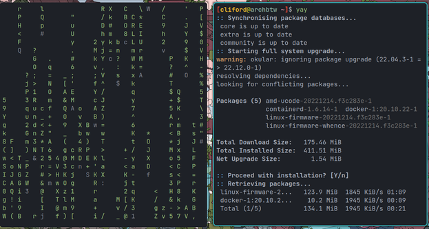
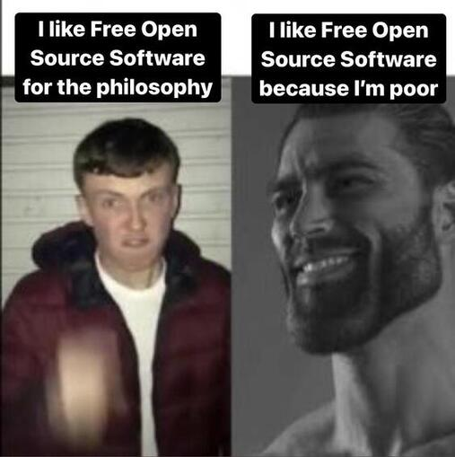
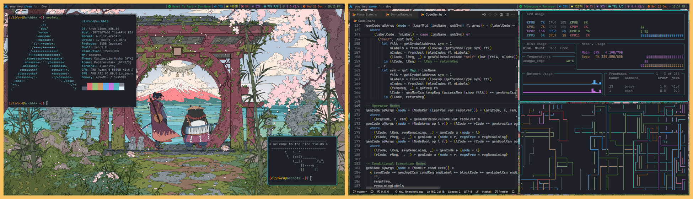


DISCLAIMER: this might be a bit too long. <a href="#tldr">jump to tldr


## Intro

No blog of mine is complete without a rant (and/or flex) about GNU/Linux and my choice of distro (take a guess). An introduction to the terms mentioned here for any uninitiated (non-existent) readers:-
- **GNU/Linux** (popularly [and arguably](https://www.gnu.org/gnu/why-gnu-linux.html) known as Linux): An open-source operating system (which can be [free](https://www.gnu.org/philosophy/free-sw.en.html))
- **Rice**: a swamp grass which is widely cultivated as a source of food

Now that we have the essential information, we can get on to the story of how my experience with Linux led me to start a tech-repair empire by ["putting it in rice"](https://www.urbandictionary.com/define.php?term=Did%20You%20Try%20Putting%20It%20In%20Rice%3F). I was approximately 0.38 years old when I first laid eyes on a rice grain .....

Just kidding. I don't know why I felt the need to add in this pointless section, but you, a person who made a willing (unwise) choice to read this blog, only have yourself to blame. But, for real though
- **Ricing**: a word that is commonly used to refer to making visual improvements and customizations on one's desktop. It was inherited from the practice of customizing cheap Asian import cars to make them appear to be faster than they actually were.

The best way for you to see what I mean is to check out [r/unixporn](https://www.reddit.com/r/unixporn) - one of my favourite subreddits and the foremost forum where people post their rices.

## Why you should use Linux

I don't really intend for this to be very preachy, and I'm not going to give you a cult induction speech. I'll just go over the reasons why I choose to use Linux.

### it feels really fancy

This is the primary reason that pushed me to Linux. I used to be a (filthy) Windows loyalist who used to follow the GUI install for any dev tool I wanted. And that's fine and all, but it does not compare to how cool it feels using Linux. Opening [cmatrix](https://github.com/abishekvashok/cmatrix) on one side and installing stuff using the terminal. Very hackerman™. Very cool.

{{}}

It just feels a lot more cool when you actually have control over your system rather than having a multi-billion dollar corporation shoving ads everywhere it can. I've always had an itch to customise random things which Windows could never scratch(Rainmeter can only do so much).
Which leads to my next point.

### you can customise LITERALLY everything

I cannot describe just how optimised my desktop is for my workflow. Every single thing I've wanted to change on my system, I've changed. The best example I can use is my desktop bar.

- The Spotify widget will display the song that's currently playing, pause/resume on left click, next/previous track on scroll and jump to the open spotify window on right click.
- The volume widget will adjust system volume on scroll, open a volume control panel (pavucontrol) on left click, and launch system wide noise cancellation on left click (noisetorch).
- The internet widget will show the current wifi signal/ethernet and the immediate download speed, and on click will launch a network config menu(nmtui). On right click, it will check for network connectivity.
- The date widget will launch a calendar on right click and my todo-list on left click.

This is just the GUI-related configuration. I'm barely scratching the surface of the control you can have using Linux.

### package managers 🙇

This is not about your (grossly mistreated) Amazon delivery driver. Though I'm sure they're pretty efficient in managing your packages, this section is about [pacman](https://wiki.archlinux.org/title/pacman), [apt](https://en.wikipedia.org/wiki/APT_(software)), and the like.

A package manager allows you to install, update, and uninstall software all without leaving the comfort of your terminal window, especially with community-driven repositories like the [AUR](https://wiki.archlinux.org/title/Arch_User_Repository) on Arch. Additionally, you get the option to downgrade software, set up hooks to run whatever you want (see: [customization](#you-can-customise-literally-everything)), and most importantly, update your system ONLY when you want to.

It [looks way cooler](#it-feels-really-fancy) than some "click next" installer too.

### it's a flex

Okay, it might not be a huge flex with the general public.
> "I use Linux!"
>
> _"Eh? What's that?"_

But I assure you, it'll mean something to the CS students in your life, at the very least. Leaving those _plebeians_ aside, once you get into the Linux community, we'll welcome you with open arms and a tip of the fedora.

Now, within the Linux community, there are many nuances in the distro you choose. Not really; just one distro, in particular, has this infamy.

> "I use Arch, btw!"
>
> "OMG! You're so cool!"

seems to be the expected interaction with these people. Arch Linux is a DIY distro which just drops you into a shell and allows you to hack together all the pieces of an operating system. It's a great learning experience and you get a chance to understand and make choices about every single thing on your system. There are even lower level distros like [Linux from scratch](https://www.linuxfromscratch.org/) where you build your OS from the kernel up.

On that note, I cannot leave this section without bravely proclaiming that **I, too, use Arch, btw**!

### it will finally give you some personality🤌

Linux gives you something to base your entire personality around. For people such as myself who find themselves with a [void](https://voidlinux.org/) inside, this will allow you to fill it up with a (completely pointless) sense of superiority over certain window and fruit based OS users.

It's also a really nice time sink. At this point, [my dotfiles repo](https://github.com/clifordjoshy/dotfiles) is probably the most consistently updated repo I have on there. There's always something to configure or something to improve.

We also have our own slew of Youtubers and a pretty neat community of creators, hackers, and philosophers(?). Additionally, this could even be your entry into FOSS which most likely is active in your area (probably not hot singles though, aside from myself of course) and a nice place to be if you find yourself interested in software.

There're obviously more (in my opinion, less attractive) reasons like security, ease of development, yadda yadda yadda.

And quite importantly, it's free.

{{}}

## Why you shouldn't use Linux

You might be telling me to pick a lane, but as much as it hurts me to admit it, Linux isn't for everyone (Or maybe I'm just discouraging you because, as Syndrome wisely said, "If everyone is special, no one is").

If you find yourself in one of these categories, Linux probably isn't for you
- you want everything to "just work".
- you aren't particularly interested in computers or the ideology of free software.
- you spend most of your time gaming (this is definitely something that's possible on Linux, but you might find yourself spending more time trying to set things up than actually gaming)
- you use a bunch of software that's not available on Linux (though I'm sure you'll be able to find open-source alternatives)

## Rice 🍚

In case you've forgotten (which is quite likely considering the size of the above essay. oof), ricing is the act of customising one's desktop. So, what does this mean? How far even can customisation go?

Let me start off by using this as a chance to flex my rice.

### Window Managers

A window manager, as the name suggests, manages your windows. There're two primary kinds you need to be aware of, floating and tiling.

A floating window manager is probably what you're used to. Each time you open a window, it opens in a floating mode which you can drag around and resize as you see fit.

A tiling window manager on the other hand always arranges the window to utilise the available space optimally. You can obviously configure how you want it to tile and whatnot, but the essential difference is the utilisation of screen real estate. I'm personally a major fan of tiling WMs and have grown quite comfortable with the [Awesome window manager](https://awesomewm.org/). You can see this in action in the second screenshot above.

### Colour Scheming & Theming

You might be used to changing to a dark mode there or a light mode here. Well, theming on Linux is leagues ahead of all of that. Considering that you'll be spending a lot of time on the terminal, the first thing you need to decide on is a terminal colour scheme. Good thing there's way too many options.

That's all well and good. You have a terminal colour scheme now. Why stop at the terminal, though. What if every app you had installed respected those themes. Well, that's where we're at.

A lot of the apps you use will either be made with the GTK or QT toolkits. Each of these toolkits allows you to specify a global theme that will be respected across all apps that use those toolkits. And the apps that don't act as such very likely have individual config files where you can set the colours.

What this leads to is a unified app experience that looks super clean. There even exist tools to edit the colours of popular applications that don't support this natively (such as [Spicetify](https://spicetify.app/) or [BetterDiscord](https://betterdiscord.app/)).

a colour scheme recommendation:  [catppuccin](https://github.com/catppuccin/catppuccin)

### Keybinds

If you'd in noticed the screenshots above, I do not have any desktop icons. That's because I launch all my critical apps with keybinds. I have keybinds to control music, launch whatsapp, control my windows and anything else I can imagine. Helps me get ever closer to the hackerman™ ideals of using a computer without the mouse.

Though this might not be a visually appealing factor, the sheer amount of street cred you gain moving windows around and furiously typing away without taking your hands off the keyboard is obviously worth it.

### Widgets

[As mentioned earlier](#you-can-customise-literally-everything), I have a whole load of functionality packed into my top bar. Each and every facet of this is programmable to your heart's content. You can build and have your own widgets showing whatever information you want anywhere you want.

Tools such as [conky](https://github.com/brndnmtthws/conky) and [eww](https://github.com/elkowar/eww) can spice up your desktop with some beautiful widgets.

### Anything else you want

There's just so much more that you can do with all of this. Even I'm constantly baffled by the things people accomplish with their desktops. If you've ever dreamed of small improvements you would've made to the UI of your OS, this is your outlet.

----------

<a name="tldr">TLDR; linux good. i like to eat rice.</a>
