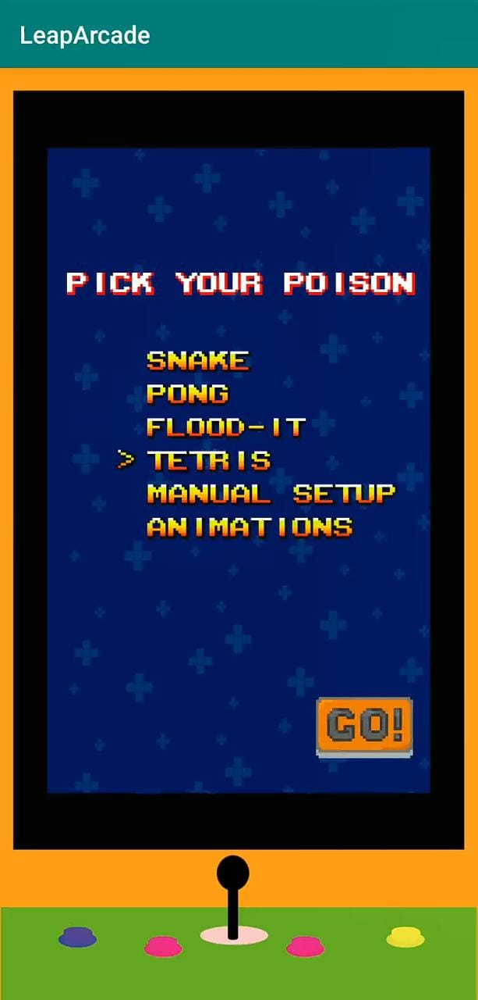


<figure style="display: inline-block"><figcaption>as a clock</figcaption></figure>
<figure style="display: inline-block"><figcaption>as a music visualizer</figcaption></figure>
<figure style="display: inline-block"><figcaption>the android app</figcaption></figure>


## Links
[:(fa-icon fa-brands fa-github): GitHub](https://github.com/clifordjoshy/LeapRGB)

## About

### The Thing
A 16x15 grid of WS2811 LEDs, a 15A power supply and a NodeMCU. Serves as which serves as a clock, an arcade (with a bunch of classic games like Snake, Tetris, Pong and Flood-It!), a music visualizer all controllable from an Android app.

By default, it starts in the clock mode, which fetches time using NTP and displays it (pictured above). There's a button on the side which allows you to switch to the app controlled mode.

In the app mode, the NodeMCU starts a websocket server, which the app connects and sends instructions too. This allows it to be used as a music visualizer and a minimal arcade.

### The App
A native Android app built in Java which serves as a Websocket client and transmits data to the board via WiFi.

## Personal Notes

### History
This was one of my very first projects and pretty much the first time I did anything hardware related. I learnt a whole lot about programmable LEDs, microcontrollers and the very fundamentals of app dev. It started off based on a random Reddit post where someone was playing snake using the cells of their bookshelf. I initially wanted to replicate that, but the crushing reality that my average-sized bookshelf would never be enough dawned on me.

So, I switched to this dedicated board setup and added some of my favourite games like Snake and Pong. Throughout this whole process, I was so unsure whether it would pan out, and I was really pleased with myself when it eventually did. Later on, I ended up adding the music visualizer and a clock mode too.

Unfortunately, that was the end of the development of this project, I eventually ended up repurposing all the parts of this project for other projects. (RIP)

### Retrospect
When I built this, I was an absolute beginner and had only a very fundamental understanding of networking and hardware. A glaring issue that was present here is that every time the board turned on, it would get a dynamic IP. The app required this IP to communicate with the board. The 'genius' (at the time) solution I came up with was to print the IP on the display and have a field in the app to change the value. This whole problem could've been avoided had I just known to use a static IP. You live and learn.

Another issue plaguing this project was the latency. Sometimes, there would be a whole second of delay between when the app sent the data and when the board received it. Instead of using WebSockets, the current me would've just used plain old sockets. Would've noticeably improved the speed.